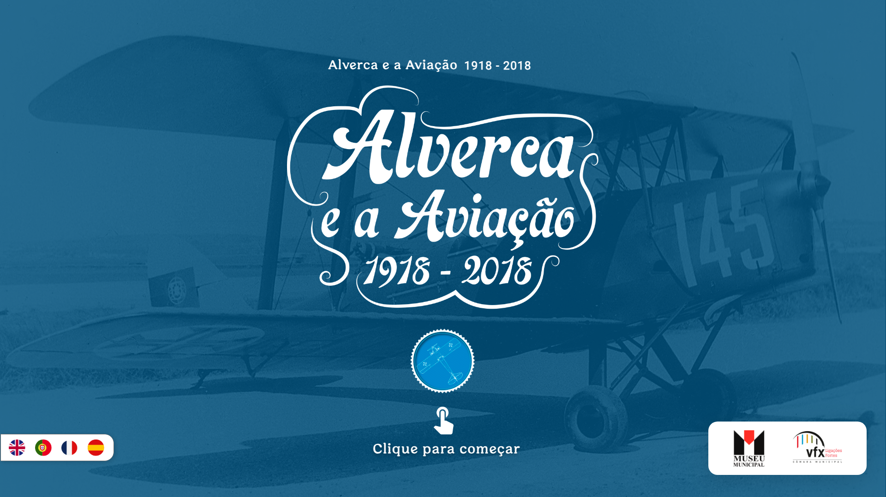
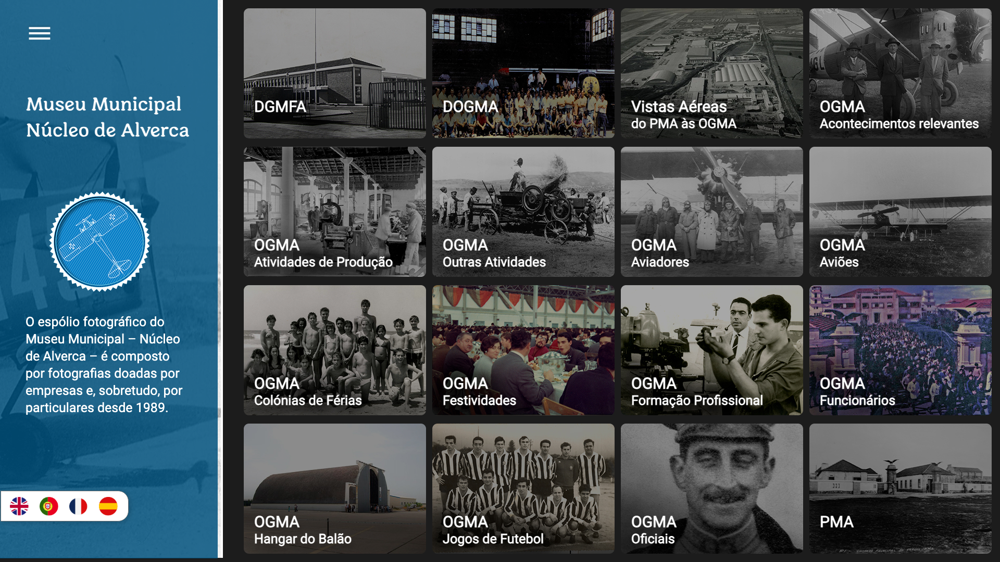
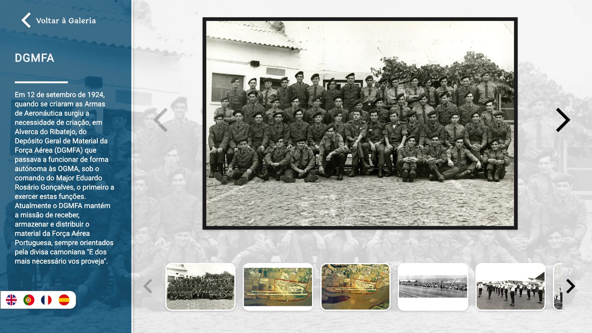

<div align="center">
  

  <h1>Museu Municipal — Núcleo de Alverca</h1>
  <p><em>Interactive digital kiosk for a Portuguese municipal museum, showcasing local history and cultural heritage through a multilingual, touchscreen-friendly experience.</em></p>

  <p>
    
    
    
    
    
  </p>

  <p>
    <a href="https://quiosque-alverca.afonsobenedito.com"><strong>View Live Demo →</strong></a>
  </p>

  <br />

  
</div>

---

## About the Project

The **Museu Municipal – Núcleo de Alverca** holds a photographic archive composed of images donated by companies and individuals since 1989. This project brings that archive to life as a **touchscreen kiosk**, designed to run inside the museum and allow visitors to explore local history in an immersive, accessible way.

Visitors can browse **16 curated exhibits** spanning the history of Alverca, with access to over **680 photographs**, videos, and detailed descriptions — all presented through a clean, full-screen interface optimised for a 1920×1080 display.

---

## Features

- **Touchscreen-first design** — built for large, wall-mounted displays in a museum environment
- **Multilingual** — full support for 🇵🇹 Portuguese, 🇬🇧 English, 🇪🇸 Spanish, and 🇫🇷 French
- **Rich media** — image carousels, video playback, and high-resolution photography
- **Smooth animations** — fluid page transitions powered by Framer Motion
- **Aspect-ratio locked** — always renders at 1920×1080, scaled to fit any screen
- **Idle detection** — automatically returns to the home screen after inactivity
- **Static & deployable** — no backend required; runs fully in the browser

### Exhibit browser

Browse all 16 exhibits from a single grid, with thumbnail previews and titles in the selected language.



### Exhibit detail

Each exhibit opens a full-screen view with a scrollable photo carousel, historical descriptions, and video content.



---

## Tech Stack

| Layer | Technology |
|---|---|
| Framework | [React 17](https://reactjs.org/) |
| Build tool | [Vite 6](https://vitejs.dev/) |
| Routing | [React Router v5](https://v5.reactrouter.com/) |
| Animations | [Framer Motion](https://www.framer.com/motion/) |
| Deployment | [GitHub Pages](https://pages.github.com/) |

---

## Getting Started

**Prerequisites:** Node.js 18+ and npm.

```bash
# Clone the repository
git clone https://github.com/AfonsoBenedito/quiosque-alverca.git
cd quiosque-alverca

# Start the development server
make local-up
```

The app will be available at **[http://localhost:5173](http://localhost:5173)**.

To stop the server:

```bash
make local-down
```

### Building for production

```bash
cd front-end
npm run build
```

The output will be in `front-end/dist/`.

---

## License

Distributed under the [MIT License](LICENSE).
